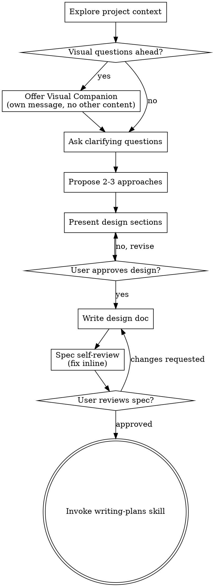

# 将想法头脑风暴为设计方案

通过自然的协作对话，帮助将想法转化为完整的设计方案和规格说明。

首先了解当前项目的上下文，然后逐一提问来细化想法。当你理解了要构建的内容后，展示设计方案并获得用户批准。

<HARD-GATE>
在展示设计方案并获得用户批准之前，不要调用任何实现技能、编写任何代码、搭建任何项目或采取任何实现行动。这适用于每个项目，无论看起来多么简单。
</HARD-GATE>

## 反模式："这太简单了，不需要设计"

每个项目都要经过这个流程。一个待办列表、一个单函数工具、一个配置修改——全都不例外。"简单"的项目恰恰是最容易因为未审视的假设而浪费工作的地方。设计可以很简短（对于真正简单的项目几句话即可），但你必须展示设计并获得批准。

## 检查清单

你必须为以下每一项创建任务，并按顺序完成：

1. **探索项目上下文** — 检查文件、文档、最近的提交
2. **提供可视化伴侣**（如果主题涉及视觉问题）——作为独立消息发送，不与澄清问题合并。参见下方的可视化伴侣部分。
3. **提出澄清问题** — 每次一个问题，了解目的/约束/成功标准
4. **提出 2-3 种方案** — 包含权衡分析和你的推荐
5. **展示设计方案** — 按复杂度分节展示，每节展示后获得用户批准
6. **编写设计文档** — 保存到 `docs/superpowers/specs/YYYY-MM-DD-<topic>-design.md` 并提交
7. **规格自查** — 快速内联检查占位符、矛盾、歧义、范围（见下文）
8. **用户审阅书面规格** — 在继续之前请用户审阅规格文件
9. **转入实现阶段** — 调用 writing-plans 技能创建实现计划

## 流程图

**最终状态是调用 writing-plans。** 不要调用 frontend-design、mcp-builder 或任何其他实现技能。头脑风暴之后你唯一应该调用的技能是 writing-plans。

## 流程详解

**理解想法：**

- 首先了解当前项目状态（文件、文档、最近的提交）
- 在提出详细问题之前，评估范围：如果请求描述了多个独立的子系统（例如"构建一个包含聊天、文件存储、计费和分析的平台"），请立即指出。不要在需要先拆分的项目上花时间细化细节。
- 如果项目太大无法用单个规格描述，帮助用户拆分为子项目：哪些是独立的部分，它们如何关联，应该按什么顺序构建？然后通过正常的设计流程对第一个子项目进行头脑风暴。每个子项目都有自己独立的规格 -> 计划 -> 实现周期。
- 对于范围合适的项目，逐一提问来细化想法
- 尽可能使用多选题，但开放式问题也可以
- 每条消息只问一个问题——如果某个主题需要更多探索，将其拆分为多个问题
- 重点理解：目的、约束、成功标准

**探索方案：**

- 提出 2-3 种不同的方案及其权衡分析
- 以对话方式展示选项，附带你的推荐和理由
- 先展示你推荐的选项并解释原因

**展示设计方案：**

- 当你认为已经理解了要构建的内容时，展示设计方案
- 每个部分的篇幅与复杂度匹配：简单的情况用几句话，复杂的情况最多 200-300 字
- 每个部分展示后询问是否正确
- 覆盖：架构、组件、数据流、错误处理、测试
- 如果有不明白的地方，随时回头澄清

**为隔离和清晰而设计：**

- 将系统拆分为更小的单元，每个单元有一个明确的目的，通过定义良好的接口通信，并且可以独立理解和测试
- 对于每个单元，你应该能回答：它做什么，怎么使用它，它依赖什么？
- 其他人能否在不阅读内部实现的情况下理解一个单元的功能？你能否在不破坏使用方的情况下修改内部实现？如果不能，边界需要调整。
- 更小的、边界清晰的单元对你来说也更容易操作——你能更好地推理一次性能放入上下文的代码，当文件聚焦时你的编辑也更可靠。当一个文件变得很大时，这通常是它在做太多事情的信号。

**在现有代码库中工作：**

- 在提出修改之前先探索当前结构。遵循现有模式。
- 当现有代码中存在的问题会影响当前工作（例如文件变得太大、边界不清晰、职责纠缠），将针对性改进纳入设计方案——就像优秀的开发者改进他们正在工作的代码一样。
- 不要提出无关的重构。保持专注于服务当前目标的部分。

## 设计之后

**文档：**

- 将经过验证的设计（规格）写入 `docs/superpowers/specs/YYYY-MM-DD-<topic>-design.md`
  - （用户对规格位置的偏好优先于此默认值）
- 如果有 elements-of-style:writing-clearly-and-concisely 技能可用，请使用
- 将设计文档提交到 git

**规格自查：**
编写规格文档后，以全新的视角审视它：

1. **占位符扫描：** 是否有"TBD"、"TODO"、不完整的部分或模糊的需求？修复它们。
2. **内部一致性：** 是否有部分相互矛盾？架构是否与功能描述匹配？
3. **范围检查：** 这是否足够聚焦以适配单个实现计划，还是需要拆分？
4. **歧义检查：** 是否有需求可以被两种不同方式理解？如果有，选择一种并明确说明。

内联修复所有问题。无需重新审阅——修复后继续即可。

**用户审阅关卡：**
规格自查通过后，请在继续之前请用户审阅书面规格：

> "规格已编写并提交到 `<path>`。请审阅并告诉我是否需要在开始编写实现计划之前进行任何修改。"

等待用户的回复。如果他们要求修改，进行修改后重新运行规格自查循环。只有在用户批准后才继续。

**实现：**

- 调用 writing-plans 技能创建详细的实现计划
- 不要调用任何其他技能。writing-plans 是下一步。

## 核心原则

- **每次一个问题** - 不要用多个问题让人不知所措
- **优先使用多选题** - 在可能的情况下比开放式问题更容易回答
- **严格执行 YAGNI** - 从所有设计中移除不必要的功能
- **探索替代方案** - 在确定方案之前始终提出 2-3 种方案
- **渐进式验证** - 展示设计，在继续之前获得批准
- **保持灵活** - 当有不明白的地方随时回头澄清

## 可视化伴侣

一个基于浏览器的伴侣，用于在头脑风暴过程中展示模型、图表和视觉选项。作为工具可用——不是一种模式。接受伴侣意味着它可以用于从视觉展示中受益的问题；这并不意味着每个问题都要通过浏览器处理。

**提供伴侣：** 当你预感后续问题会涉及视觉内容（模型、布局、图表）时，提供一次以获取同意：
> "我们正在讨论的一些内容如果能用浏览器展示可能会更容易理解。我可以为我们准备模型、图表、对比和其他视觉内容。这个功能仍然较新，可能会消耗较多 token。想试试吗？（需要打开一个本地 URL）"

**这个提议必须作为独立的消息发送。** 不要将其与澄清问题、上下文摘要或任何其他内容合并。该消息应只包含上述提议，不含其他内容。等待用户回复后再继续。如果他们拒绝，继续纯文本头脑风暴。

**逐问题决策：** 即使用户已接受，也要为每个问题决定是使用浏览器还是终端。判断标准：**用户通过看到它是否比读到它更容易理解？**

- **使用浏览器**处理本身是视觉的内容——模型、线框图、布局对比、架构图、并排视觉设计
- **使用终端**处理文本类内容——需求问题、概念选择、权衡列表、A/B/C/D 文本选项、范围决策

一个关于 UI 主题的问题不自动是视觉问题。"个性在这个上下文中意味着什么？"是概念性问题——使用终端。"哪种向导布局更好？"是视觉问题——使用浏览器。

如果他们同意使用伴侣，在继续之前阅读详细指南：
`skills/brainstorming/visual-companion.md`
